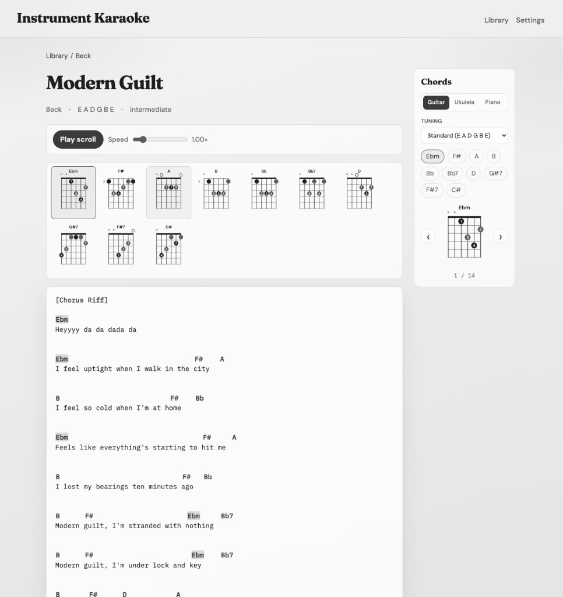
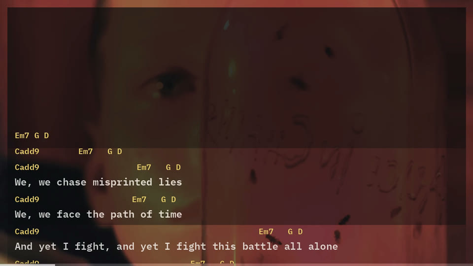
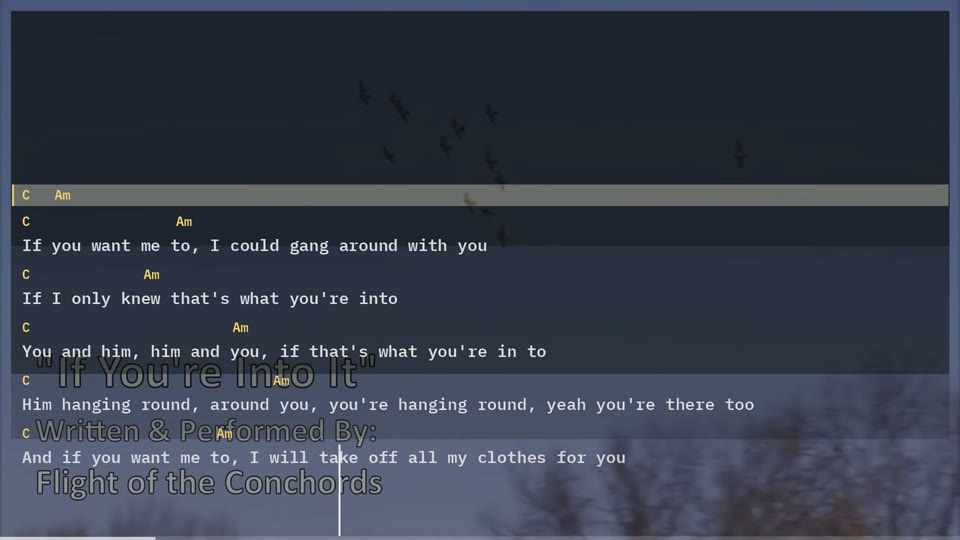

# Instrument Karaoke Agent Skill

Local Ultimate-Guitar chord importer (Cursor skills) + a static HTML library viewer with chord diagrams, karaoke stem mixes, and auto-scroll.

**Live example:** [https://higginsrob.github.io/instrument-karaoke-agent-skill/](https://higginsrob.github.io/instrument-karaoke-agent-skill/)



### Demo videos

Karaoke stem mixes with synced chord/lyric overlays (exported from the local media player):

[](https://youtu.be/KUxeqS6Q7gA)

[Nutshell — no vocal](https://youtu.be/KUxeqS6Q7gA)

[](https://youtu.be/UX3dfahg8ak)

[If You're Into It — no guitar](https://youtu.be/UX3dfahg8ak)

## Features

- **`/ug-import <url>`** — fetch a [Ultimate-Guitar](https://tabs.ultimate-guitar.com/) chords tab, convert to monospace markdown with YAML metadata, save under `library/`
- **Static site** — browse by artist / album, click chords for fretboard diagrams, play auto-scroll at per-song speed
- **Admin mode** — `make server` enables editing song metadata, chart text, `scroll_speed`, `start_delay`, and YouTube URL (saved into the library)
- **Media pipeline** — optional Docker API (`make media-up` / `make media-up-gpu`) downloads YouTube audio, splits with `htdemucs` (4 stems), pre-renders karaoke stereo mixes, force-aligns lyrics/chords to VTT, and converts drums to MIDI; admin queue + 16:9 song canvas for review
- **Deployed mode** — GitHub Pages is read-only and uses `scroll_speed` / `start_delay` from published song files
- **Gitignored library** — your charts and media stay local by default; `make github-pages` publishes a **charts-only** demo to the `gh-pages` branch (Scroll view; no Video player)
- **CI** — unit/smoke tests on pull requests and `main`

## Quick start

```bash
# seed demo song
cp -R fixtures/demo-library/. library/
python3 scripts/rebuild_index.py

make server
# open http://127.0.0.1:8765/  (admin — Edit on a song page to save changes)
```

Import a live tab (personal use):

```bash
make import URL='https://tabs.ultimate-guitar.com/tab/beck/country-down-chords-1466425'
# or in Cursor: /ug-import <url>
```

## Admin vs deployed

| Mode | How | Behavior |
|------|-----|----------|
| **Admin** | `make server` (binds `127.0.0.1:8765`) | `GET /api/status`, `PUT /api/song`, queue/media APIs — Edit / Save writes `library/**/*.md` and can enqueue media jobs |
| **Prod (local)** | `make prod` | Builds `_site/` and serves it with **no** `/api/*` routes — same read-only UI as Pages |
| **Deployed** | `make github-pages` → `gh-pages` branch | Charts only — no write API, no Video player; auto-scroll uses `scroll_speed` |

Tune `scroll_speed` in admin while practicing, then run `make github-pages` when you want the public chart demo updated.

### Publish the static demo (`make github-pages`)

Resets the `gh-pages` branch to the latest `main`, force-adds your local chord charts (normally gitignored), and force-pushes. That branch is the GitHub Pages source for the example:

[https://higginsrob.github.io/instrument-karaoke-agent-skill/](https://higginsrob.github.io/instrument-karaoke-agent-skill/)

Included on `gh-pages` only:

- Song markdown + `library/index.json`
- **Not** included: mixes, stems, YouTube video/audio, posters, VTT, or other media cache

The deployed site is **Scroll** view only. Karaoke / Video mode stays on your local admin server (`make server` + `make media-up`).

```bash
make github-pages
```

Requires a clean tracked working tree and a non-empty local `library/`.
### Media pipeline (optional)

```bash
make media-up        # CPU Docker API on :8093
# or on NVIDIA hosts:
make media-up-gpu

make server          # admin UI proxies to MEDIA_API_URL (default http://127.0.0.1:8093)
```

In song **Edit**, set a **YouTube URL** and Save. If the song has not been processed (or the URL changed), a job is queued. Open **Queue** in the nav for status. When processing finishes (`needs_review`), a 16:9 canvas appears above the chart — edit lyrics/chords VTT, then **Verify**.

Artifacts live beside the song markdown:

```
library/artists/<artist>/albums/<album>/<song>.md
library/artists/<artist>/albums/<album>/<song>/
  media.json  youtube/  stems/  mixes/  lyrics.vtt  chords.vtt  drums_beats.json  drums.mid
```

The player streams muted video plus **one** audio file at a time from `mixes/` — Original, a karaoke mix (no vocals / bass / guitar-piano / drums), or a solo stem (`stem-*.mp3`). It never streams multiple stems together. In admin Edit, **Reprocess media** force-queues the pipeline again for that song.

See [services/media-pipeline/README.md](services/media-pipeline/README.md).

## Song format

```markdown
---
title: Country Down
artist: Beck
album: singles
tuning: E A D G B E
capo: 0
key: null
difficulty: intermediate
source: "https://tabs.ultimate-guitar.com/tab/..."
source_id: "1466425"
imported_at: 2026-07-30
scroll_speed: 1.0
start_delay: 0
youtube_url: ""
media_status: none
chords: [G, C, C/B, Am, F, D]
---

```
[Intro]
G         C   G          C
...
```
```

`scroll_speed` is a multiplier of the viewer’s base auto-scroll curve (`0.5`–`4`, default `1.0` when omitted).

`start_delay` is seconds to count down before auto-scroll begins when playing from the top of the song (`0`–`30`, default `0` when omitted). Pause/resume mid-chart skips the delay.

Path layout:

```
library/artists/<artist>/albums/<album|singles>/<song>.md
library/index.json
```

## Cursor skills

| Skill | Trigger |
|-------|---------|
| [ug-import](.cursor/skills/ug-import/SKILL.md) | `/ug-import <ug-url>` |
| [chord-cleanup](.cursor/skills/chord-cleanup/SKILL.md) | `/chord-cleanup <path>` |
| [library-organize](.cursor/skills/library-organize/SKILL.md) | `/library-organize` |

## Make targets

| Target | Action |
|--------|--------|
| `make server` | Serve site at http://127.0.0.1:8765 (**admin**) |
| `make build` | Build static site into `_site/` |
| `make prod` | Build + serve static site at http://127.0.0.1:8080 (no admin; `PORT=…` to override) |
| `make index` | Rebuild `library/index.json` |
| `make test` | Unit + smoke tests |
| `make import URL=...` | Import a UG tab URL |
| `make github-pages` | Publish charts-only static demo to `gh-pages` (no media) |
| `make media-up` | Start CPU media-pipeline Docker API on :8093 (does **not** rebuild the image) |
| `make media-up-gpu` | Start GPU media-pipeline Docker API on :8093 |
| `make media-build-cpu` | Build CPU media-pipeline image |
| `make media-build-gpu` | Build GPU media-pipeline image |
| `make media-build` | Build CPU + GPU images |
| `make media-down` | Stop media-pipeline containers |
| `make youtube-cookies` | Export YouTube cookies for yt-dlp (`BROWSER=chrome`) |

## Optional public library (submodule)

`library/` is gitignored on `main`. For a separate always-public collection you can still use a submodule:

```bash
git submodule add https://github.com/<you>/instrument-karaoke-library.git library
# import songs, then commit inside library/ and push that repo
```

The intentional exception is `make github-pages`, which publishes a **charts-only** snapshot of `library/` to the `gh-pages` branch (no audio/video cache).

## Legal / Ultimate-Guitar

Importing fetches tab HTML for **personal practice**. Respect [Ultimate-Guitar](https://www.ultimate-guitar.com/) terms of service — do not scrape at scale, bypass paywalls, or redistribute copyrighted tabs without rights. This project does not grant any license to UG content. You are responsible for what you store and publish (including via `make github-pages`).

## Development

```bash
make test
```

Tests use the standard library (`unittest`) and committed HTML fixtures under `fixtures/` — no live network calls in CI.

## License

MIT for the software in this repository. Song charts you import remain subject to their original rights holders and UG’s terms.
